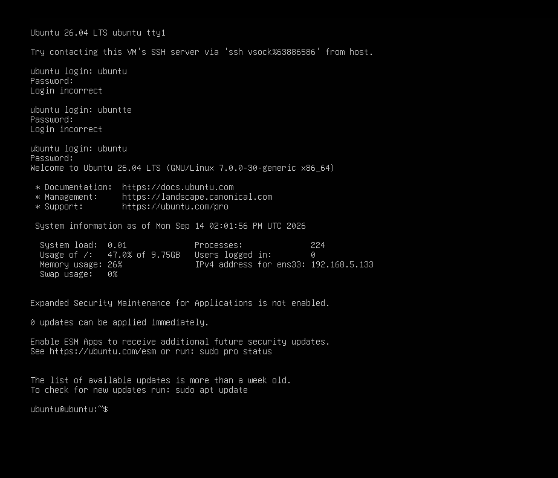

# 🔐 Day 1: Authentication & Login Monitoring with Wazuh

## 📋 Overview

This lab focuses on monitoring and investigating Linux authentication activity using **Wazuh SIEM** and an **Ubuntu Server** agent. 

The primary objective was to establish a baseline for both successful and failed authentication attempts on a Linux endpoint and understand how Wazuh detects, categorizes, decodes, and correlates authentication-related events in real time.

---

## 🎯 Objectives

- **Baseline Monitoring:** Monitor successful and failed Linux authentication activity.
- **PAM Event Analysis:** Detect and analyze Pluggable Authentication Module (PAM) events.
- **Failure Analysis:** Identify password-check failures (`unix_chkpasswd`) and failed SSH access attempts.
- **Rule & Severity Mapping:** Analyze Wazuh Rule IDs, decoders, and severity levels.
- **Temporal Analysis:** Investigate authentication timestamps and event sequences.
- **Entity Identification:** Identify targeted endpoints (Agent 002) and affected user accounts.
- **Session Lifecycle:** Track session establishment, privileges, and session termination.
- **SOC Workflow:** Develop a standardized SOC analyst investigation workflow for authentication anomalies.

---

## 💻 Lab Environment

| Component | Details |
|---|---|
| **SIEM Platform** | Wazuh SIEM 4.x |
| **Monitored OS** | Ubuntu Server |
| **Wazuh Agent Name** | `Ubuntu-Server` |
| **Wazuh Agent ID** | `002` |
| **Authentication Subsystem** | PAM / `sshd` / `unix_chkpasswd` |
| **Log Sources** | `/var/log/auth.log`, `syslog` |
| **Environment Type** | Virtualized SOC Cyber Range |

---

## 🧪 Authentication Simulation

Controlled authentication activity was generated on the target Ubuntu Server to test rule triggering and event ingestion.

### Test Sequence Executed:
1. ❌ **Failed Login Attempt #1** (Incorrect password entered)
2. ❌ **Failed Login Attempt #2** (Invalid credential check)
3. ✅ **Successful Login** (Valid credentials supplied)
4. 🔓 **Session Opened** (User session initialized via PAM)
5. 🔒 **Session Closed** (User logged out, session terminated)

This sequence provided end-to-end telemetry across both endpoint log files and the central Wazuh Dashboard.

---

## 📸 Endpoint & SIEM Telemetry

### Endpoint Terminal Simulation & System Activity
Below is the system console activity captured during the authentication simulation on the Ubuntu agent:


*Figure 1: Authentication commands and session generation on the Ubuntu Server endpoint.*

---

### Wazuh SIEM Event Detection
Wazuh captured and correlated the authentication events from the agent in real time:


*Figure 2: Real-time authentication alerts captured in the Wazuh SIEM Dashboard.*

---

## 📊 Wazuh Detections & Rule Breakdown

### 🚨 Failed Authentication Events

| Rule ID | Level / Severity | Decoder | Description | Event Impact |
|:---:|:---:|:---:|---|---|
| **5503** | `Level 5` | `pam` | **PAM: User login failed** | Indicates a failed login attempt processed via PAM. |
| **2501** | `Level 5` | `syslog` | **syslog: User authentication failure** | General system audit log reporting authentication rejection. |
| **5557** | `Level 5` | `unix_chkpasswd` | **unix_chkpasswd: Password check failed** | Indicates password verification failed during check. |
| **5760** | `Level 5` | `sshd` | **sshd: authentication failed** | Failed authentication attempt via SSH daemon. |

### 🟢 Successful Authentication & Session Events

| Rule ID | Level / Severity | Decoder | Description | Event Impact |
|:---:|:---:|:---:|---|---|
| **5501** | `Level 3` | `pam` | **PAM: Login session opened** | Confirms successful authentication and session creation. |
| **5502** | `Level 3` | `pam` | **PAM: Login session closed** | Signals normal logout and shell session termination. |

---

## 🔍 SOC Analyst Investigation Workflow

The authentication log telemetry was correlated into a linear timeline for analysis:

```text
       ┌──────────────────────────────────────────┐
       │   ❌ Failed Authentication (Rule 5503)   │
       └────────────────────┬─────────────────────┘
                            │
                            ▼
       ┌──────────────────────────────────────────┐
       │   ❌ Password Check Failed (Rule 5557)   │
       └────────────────────┬─────────────────────┘
                            │
                            ▼
       ┌──────────────────────────────────────────┐
       │  ✅ Successful Authentication (Rule 5501) │
       └────────────────────┬─────────────────────┘
                            │
                            ▼
       ┌──────────────────────────────────────────┐
       │    🔓 Login Session Opened (PAM Audit)    │
       └────────────────────┬─────────────────────┘
                            │
                            ▼
       ┌──────────────────────────────────────────┐
       │   🔒 Login Session Closed (Clean Exit)   │
       └──────────────────────────────────────────┘
```

### Analytical Key Takeaways:
- **Baseline Establishment:** Monitoring normal PAM session creation (`5501`) and closure (`5502`) establishes a baseline to detect abnormal, persistent, or orphaned sessions.
- **Correlation:** Multiple low-severity failures immediately preceding a successful authentication event highlight potential password guessing or credential validation attempts before successful entry.
- **Rule Hierarchy:** Low individual rule severity (Level 3-5) allows SOC teams to create custom high-severity threshold rules (e.g., triggering Level 10+ alerts if >5 failures occur within 60 seconds).
