# 🛠️ Wazuh SOC Home Lab: Implementation, Architecture & Configuration Guide


---

## 📋 Project Summary

| Parameter | Details |
|---|---|
| **Project Name** | Wazuh SOC / SIEM Home Cyber Range |
| **Manager Platform** | Ubuntu Server 26.04 LTS (Wazuh Central Manager) |
| **Monitored Endpoints** | Windows 10 Enterprise (`WIN10-ENDPOINT`), Ubuntu Server (`Ubuntu-Server`) |
| **Testing System** | Kali Linux (Security Testing / Attack Platform) |
| **Security Components** | Wazuh Manager, Indexer, Dashboard, Wazuh Agent, Microsoft Sysmon |
| **Current Lab Status** | **Operational** – Multi-Endpoint Telemetry Ingested & Active |

This document provides the complete, end-to-end implementation record for building a virtual **Security Operations Center (SOC)** laboratory. It covers VMware virtual networking, dual-homed network isolation, Ubuntu Server deployment, Wazuh SIEM all-in-one installation, Windows 10 agent onboarding, Sysmon endpoint telemetry integration, troubleshooting, and multi-endpoint expansion with Kali Linux and Linux agents.

---

## 📑 Table of Contents

1. [Executive Summary](#1-executive-summary)
2. [Lab Architecture & Topology](#2-lab-architecture--topology)
3. [Virtual Machine Specifications](#3-virtual-machine-specifications)
4. [VMware Virtual Network Configuration](#4-vmware-virtual-network-configuration)
5. [Ubuntu Server Installation & Network Setup](#5-ubuntu-server-installation--network-setup)
6. [Wazuh SIEM All-in-One Installation](#6-wazuh-siem-all-in-one-installation)
7. [Windows 10 Endpoint Configuration](#7-windows-10-endpoint-configuration)
8. [Wazuh Agent Installation & Registration](#8-wazuh-agent-installation--registration)
9. [Sysmon Installation & Telemetry Generation](#9-sysmon-installation--telemetry-generation)
10. [Troubleshooting & Service Management](#10-troubleshooting--service-management)
11. [Wazuh Dashboard Verification](#11-wazuh-dashboard-verification)
12. [Security Event & Alert Analysis](#12-security-event--alert-analysis)
13. [Multi-Endpoint Lab Expansion (Kali & Ubuntu)](#13-multi-endpoint-lab-expansion-kali--ubuntu)
14. [Implementation Status Matrix](#14-implementation-status-matrix)
15. [Master Command Reference](#15-master-command-reference)

---

## 1. Executive Summary

A virtual Security Operations Center (SOC) laboratory was constructed using **VMware Workstation**. An **Ubuntu Server** instance hosts central Wazuh components (Manager, Indexer, Dashboard), while a **Windows 10 Enterprise** host and an **Ubuntu Server** host serve as monitored endpoints. **Kali Linux** is deployed as an isolated security testing platform.

A dual-network design separates administrative/external traffic from internal SOC telemetry:
- **NAT Adapter:** Facilitates software updates, package installation, and internet access.
- **Host-Only Network (`VMnet1`):** Provides an isolated, non-routable communication channel (`10.10.10.0/24`) for agent-to-manager communication and attack simulations.

**Microsoft Sysmon** was installed on the Windows endpoint to augment native Windows Event Logging with detailed process creation (`Event ID 1`), network connection, and file modification telemetry. End-to-end verification confirmed active agent connectivity and central log visualization in the Wazuh SIEM Dashboard.

---

## 2. Lab Architecture & Topology

The logical communication model and network layout implemented across the SOC home lab are illustrated below:

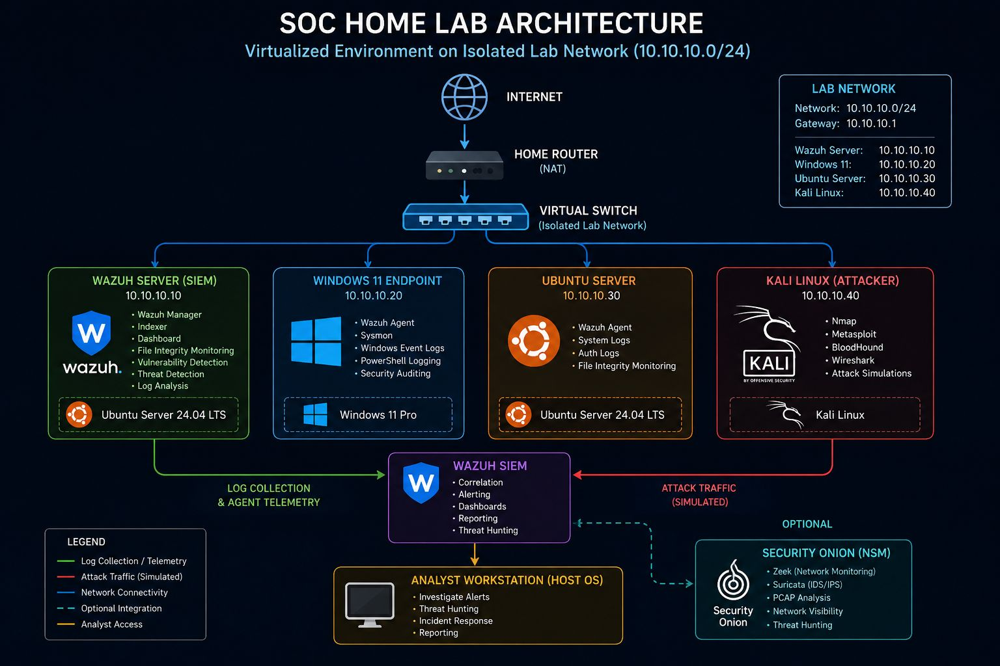
*Figure 1 – Logical Architecture of the Multi-Endpoint Wazuh SOC Home Lab.*

### Communication Roles:
- **Wazuh Server (`10.10.10.10`):** Ingests agent logs, decodes events, evaluates detection rules, indexes security alerts, and serves the Web UI.
- **Windows 10 Endpoint (`10.10.10.20`):** Runs the Wazuh Windows Agent alongside Microsoft Sysmon to stream host telemetry.
- **Kali Linux (`10.10.10.30`):** Serves as an isolated adversary node for controlled threat generation and penetration testing.
- **Ubuntu Server Endpoint (`10.10.10.40`):** Monitors Linux system events (`auth.log`, `syslog`, PAM) via the Wazuh Linux Agent.

---

## 3. Virtual Machine Specifications

The Ubuntu Server VM hosting the Wazuh manager was provisioned with sufficient hardware allocation for comfortable single-node SIEM execution.

| Virtual Machine | vCPU Cores | Memory (RAM) | Virtual Disk | Operating System |
|---|:---:|:---:|:---:|---|
| **Wazuh Server** | 4 Cores | 6 GB | 90 GB | Ubuntu Server 26.04 LTS |
| **Windows 10 Endpoint** | 2 Cores | 4 GB | 60 GB | Windows 10 Enterprise |
| **Kali Linux** | 2 Cores | 4 GB | 40 GB | Kali Linux 2024.x |
| **Ubuntu Linux Endpoint** | 2 Cores | 2 GB | 30 GB | Ubuntu Server 24.04 LTS |

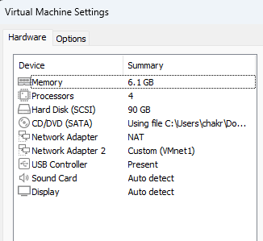
*Figure 2 – VMware hardware resource allocation for the Ubuntu/Wazuh Server VM.*

---

## 4. VMware Virtual Network Configuration

Two distinct network adapters were assigned to each VM to segregate management/internet access from internal SOC telemetry.

| Network Interface | Subnet Range | Allocation | Purpose |
|---|---|---|---|
| **VMware NAT** | Dynamic / DHCP | `192.168.3.0/24` & `192.168.5.0/24` | External internet access, repository updates, package installation |
| **VMnet1 (Host-Only)** | Static Addressing | `10.10.10.0/24` | Isolated internal SOC communication and threat simulation |

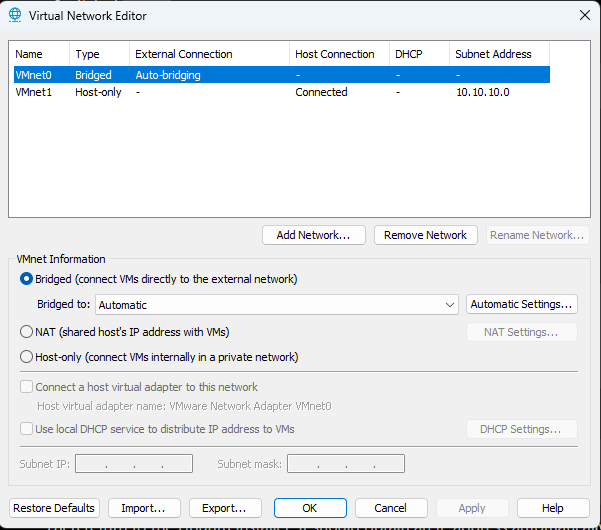
*Figure 3 – VMware Virtual Network Editor showing the Host-Only (`VMnet1`) subnet configuration (`10.10.10.0/24`).*

> 💡 **Design Note:** DHCP was disabled on `VMnet1` to enforce static IP assignments, preventing IP drift and ensuring reliable agent-manager connectivity.

---

## 5. Ubuntu Server Installation & Network Setup

Ubuntu Server 26.04 LTS was deployed as the base system for the Wazuh manager.

### Network Interface Configuration:
During initial setup, network interfaces were identified and bound to static assignments:
- `ens33`: Bound to the NAT network (`192.168.3.129/24`).
- `ens34`: Bound to the Host-Only network (`10.10.10.10/24`).

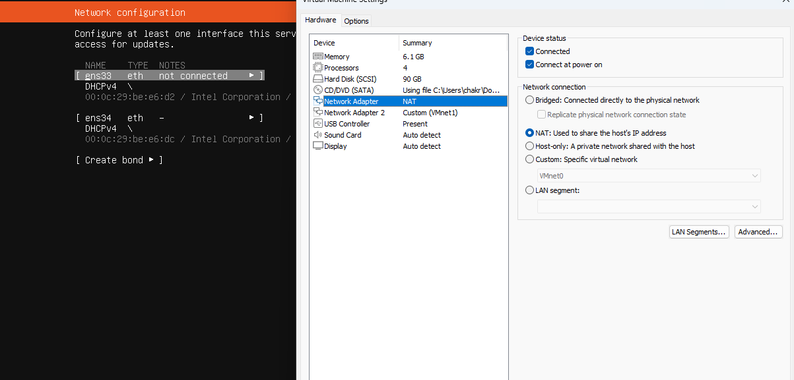
*Figure 4 – Ubuntu Server network interface configuration during setup.*

### Verification Commands:
```bash
# Check interface IP address configuration
ip a

# Verify operating system distribution release
lsb_release -a
```

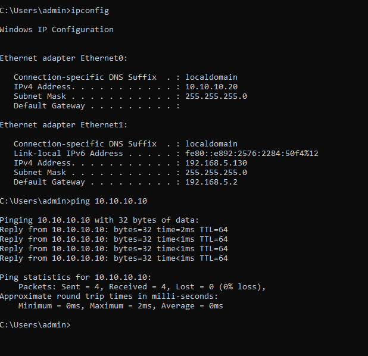
*Figure 5 – Verifying dual network interfaces (`ens33` NAT and `ens34` Host-Only) using `ip a`.*

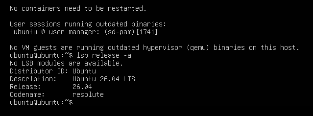
*Figure 6 – Confirming OS distribution version via `lsb_release -a`.*

---

## 6. Wazuh SIEM All-in-One Installation

The central Wazuh platform (Manager, Indexer, Dashboard) was deployed using the automated Wazuh All-in-One Installation Assistant script.

### Executing the Installer:
```bash
curl -sO https://packages.wazuh.com/4.x/wazuh-install.sh
sudo bash wazuh-install.sh -a
```

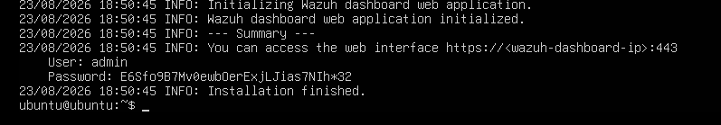
*Figure 7 – Automated execution of the Wazuh installation assistant script.*

> ⚠️ **Installation Observation:** The installer raised an OS release compatibility warning due to Ubuntu 26.04 being newer than officially verified installer targets. The installation proceeded and completed successfully. In enterprise production environments, LTS releases explicitly validated by Wazuh should be utilized.

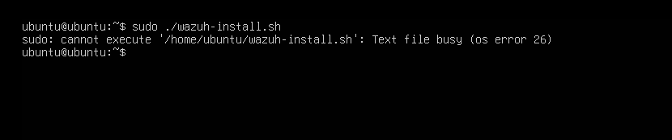
*Figure 8 – Successful installation summary showing generated administrative credentials.*

### Dashboard Access:
Upon installation completion, the web dashboard was accessed via HTTPS on port 443 over the Host-Only IP address:
```text
URL: https://10.10.10.10
User: admin
Password: [SECURELY_STORED_INSTALL_PASSWORD]
```

---

## 7. Windows 10 Endpoint Configuration

A Windows 10 Enterprise virtual machine was prepared to act as a monitored host on the `VMnet1` Host-Only network.

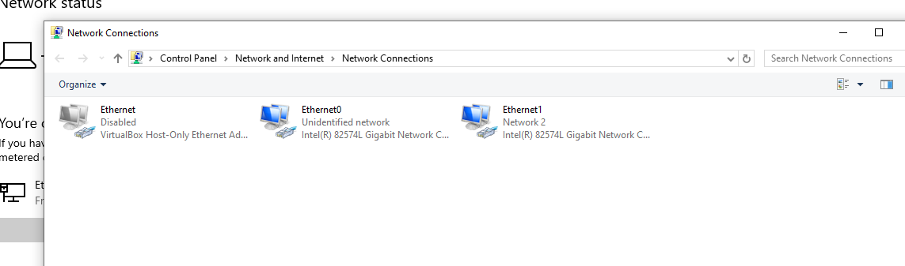
*Figure 9 – Windows Network Connections control panel displaying the assigned virtual adapters.*

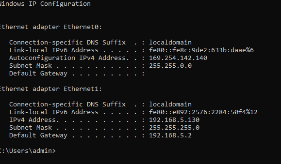
*Figure 10 – Static TCP/IPv4 property settings for the Windows 10 Host-Only interface.*

### Static Network Parameters:
- **IPv4 Address:** `10.10.10.20`
- **Subnet Mask:** `255.255.255.0`
- **Preferred DNS / Gateway:** `10.10.10.10`

### ICMP Connectivity Test:
```cmd
ping 10.10.10.10
```

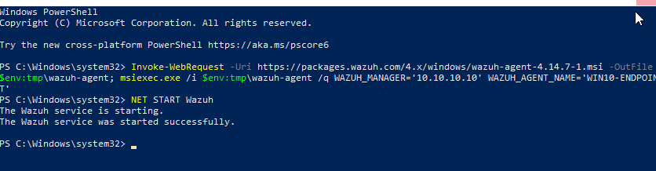
*Figure 11 – ICMP echo request ping test confirming line-of-sight reachability from Windows 10 to the Wazuh Manager.*

---

## 8. Wazuh Agent Installation & Registration

The standard 64-bit Wazuh Agent installer (`wazuh-agent.msi`) was executed on the Windows 10 endpoint.

### Configuration Parameters:
- **Wazuh Manager Address:** `10.10.10.10`
- **Agent Name:** `WIN10-ENDPOINT`
- **Protocol:** `1514/UDP` (or TCP)

### Agent Log Verification:
To confirm successful registration and connectivity, the agent log file was examined:
```powershell
Get-Content 'C:\Program Files (x86)\ossec-agent\ossec.log' -Tail 30
```

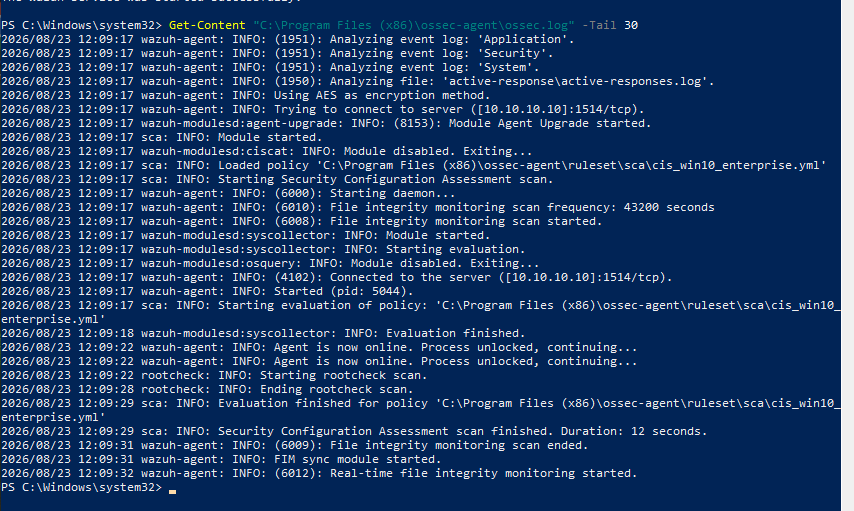
*Figure 12 – Agent log snippet confirming active connection and server registration.*

---

## 9. Sysmon Installation & Telemetry Generation

To enhance endpoint visibility beyond default Windows Security logs, **Microsoft System Monitor (Sysmon)** was installed.

### Installation Command:
```cmd
Sysmon64.exe -i sysmonconfig.xml -accepteula
```

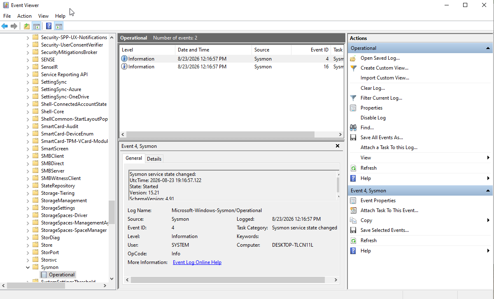
*Figure 13 – Windows Event Viewer displaying the initialized Sysmon Operational Log channel.*

### Configuration & Validation:
```cmd
Sysmon64.exe -c sysmonconfig.xml
```

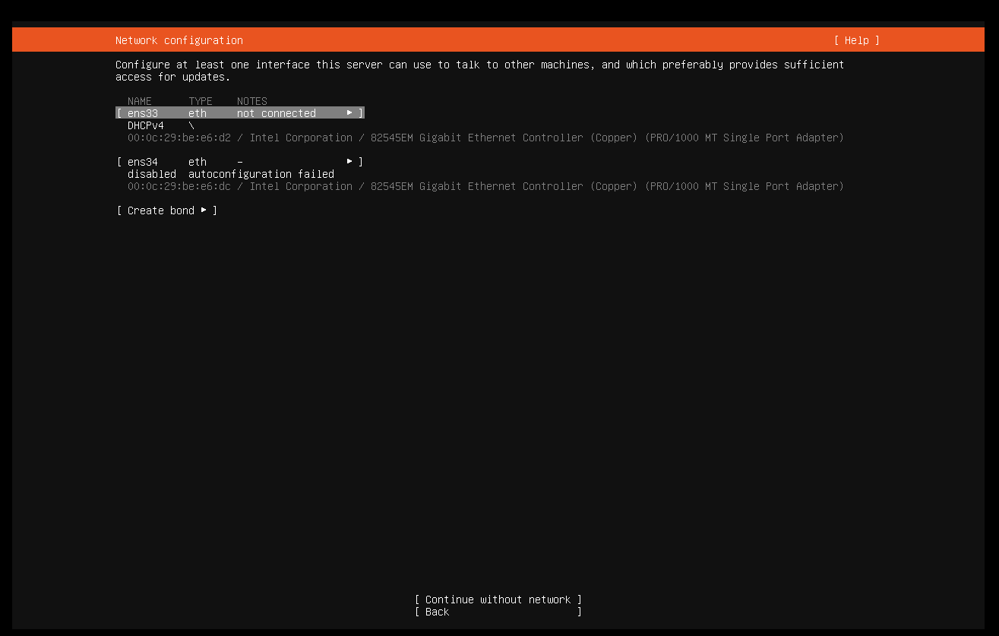
*Figure 14 – Validating active Sysmon XML schema parameters and filtering rules.*

### Test Telemetry Generation:
System activity was simulated by launching processes such as `notepad.exe` and `cmd.exe` to trigger Sysmon Event ID 1 (Process Creation) and Event ID 5 (Process Termination).

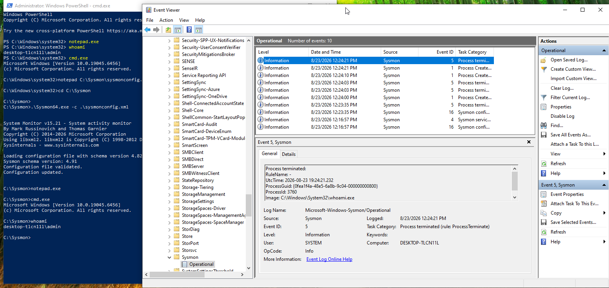
*Figure 15 – Sysmon Event Viewer capturing process creation logs generated by test execution.*

---

## 10. Troubleshooting & Service Management

### Issue: Shell Context Command Errors
During agent validation, entering PowerShell cmdlets (`Get-Service`) inside standard `cmd.exe` windows resulted in command syntax errors (`'Get-Service' is not recognized...`).

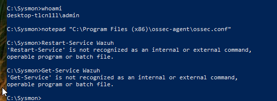
*Figure 16 – Shell syntax discrepancy when attempting PowerShell cmdlets inside standard command prompts.*

### Service Verification & Administrator Privilege:
Checking or restarting the Wazuh Agent service requires an elevated PowerShell instance (`Run as Administrator`):

```powershell
# Check service status
Get-Service Wazuh

# Restart agent service
Restart-Service Wazuh
```

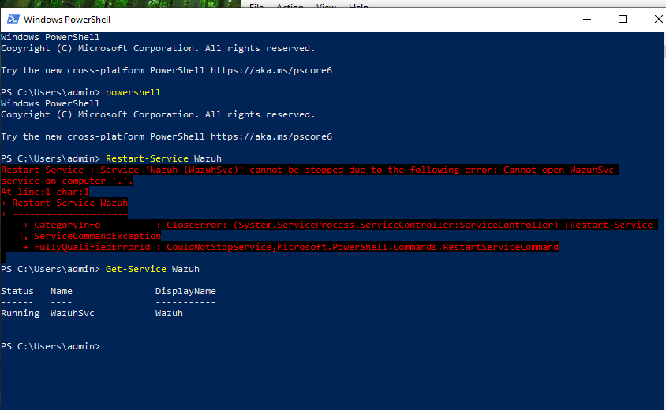
*Figure 17 – Verifying that the Wazuh Agent service status is in the Running state.*

---

## 11. Wazuh Dashboard Verification

After completing registration, the Windows 10 host appeared in the central Wazuh SIEM dashboard with an **Active** status.

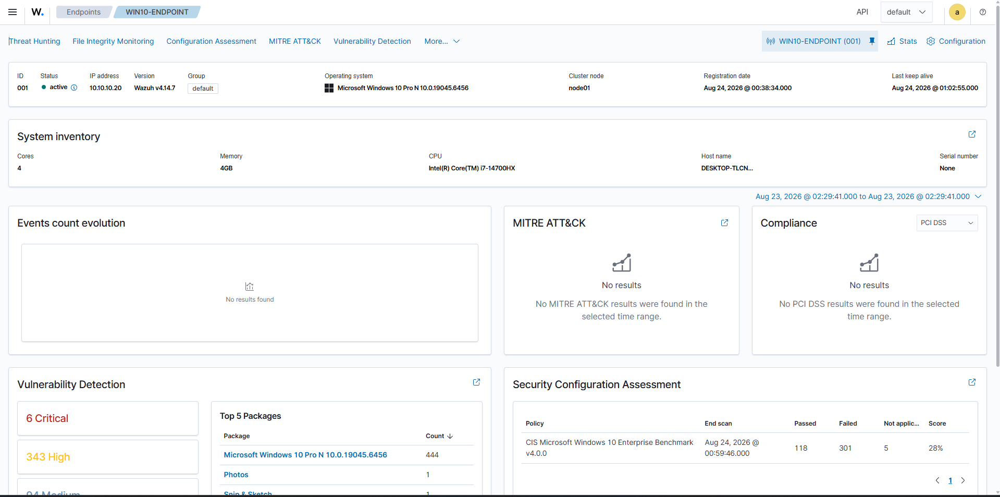
*Figure 18 – Wazuh Dashboard showing the active `WIN10-ENDPOINT` agent inventory detail.*

### Discovered Inventory Metadata:
- **Agent Name / ID:** `WIN10-ENDPOINT` / `001`
- **OS Details:** Microsoft Windows 10 Enterprise
- **IP Address:** `10.10.10.20`
- **Registration Status:** Active

---

## 12. Security Event & Alert Analysis

Real-time telemetry generated by the Windows endpoint was processed through the Wazuh analysis engine, successfully matching detection rules and populating the Events view.

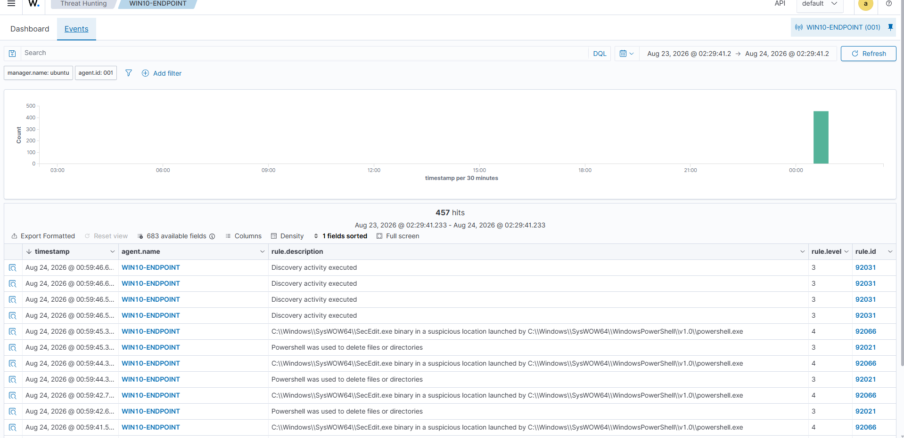
*Figure 19 – Wazuh SIEM Events interface showing security alerts ingested from `WIN10-ENDPOINT`.*

### Key Rule Categories Triggered:
1. **System Discovery Activity:** Ingestion of host discovery and enumeration commands.
2. **PowerShell Execution Behavior:** Tracking interactive PowerShell invocations and script block executions.
3. **SecEdit / Audit Modifications:** Alerting on system security policy checks and process executions.

---

## 13. Multi-Endpoint Lab Expansion (Kali & Ubuntu)

To convert the single-agent setup into a complete multi-node SOC range, **Kali Linux** (testing node) and an **Ubuntu Server Endpoint** were integrated into `VMnet1`.

### Expanded Network Topology:

| System Name | Host Role | Internal IP (`VMnet1`) | External IP (NAT) | Agent Status |
|---|---|:---:|:---:|:---:|
| **Wazuh Server** | SIEM Manager / Indexer / Dashboard | `10.10.10.10` | `192.168.3.129` | **Server** |
| **WIN10-ENDPOINT** | Windows Monitored Host | `10.10.10.20` | Dynamic | **Active** |
| **Kali Linux** | Security Testing Platform | `10.10.10.30` | `192.168.5.131` | **N/A (Attacker)** |
| **Ubuntu-Server** | Linux Monitored Host | `10.10.10.40` | `192.168.5.133` | **Active / Connected** |

---

### Ubuntu Linux Endpoint Onboarding:

#### 1. Package Installation:
The Wazuh Agent `.deb` package was downloaded and installed on the secondary Ubuntu Server host:

```bash
wget https://packages.wazuh.com/4.x/apt/pool/main/w/wazuh-agent/wazuh-agent_4.14.7-1_amd64.deb
sudo dpkg -i wazuh-agent_4.14.7-1_amd64.deb
```

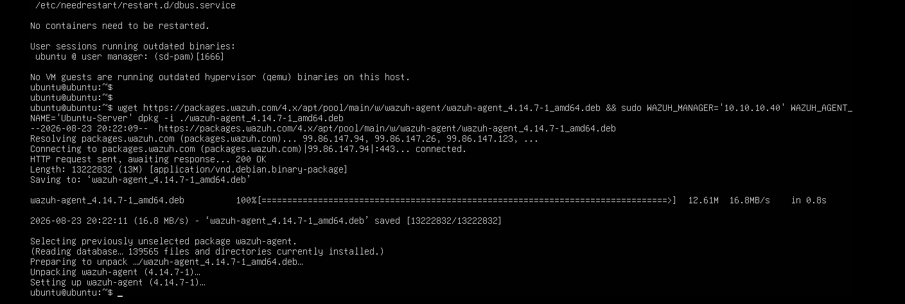
*Figure 20 – Installing the Wazuh Agent Debian package on the Ubuntu Linux endpoint.*

#### 2. Service Management:
```bash
sudo systemctl enable wazuh-agent
sudo systemctl start wazuh-agent
sudo systemctl status wazuh-agent
```

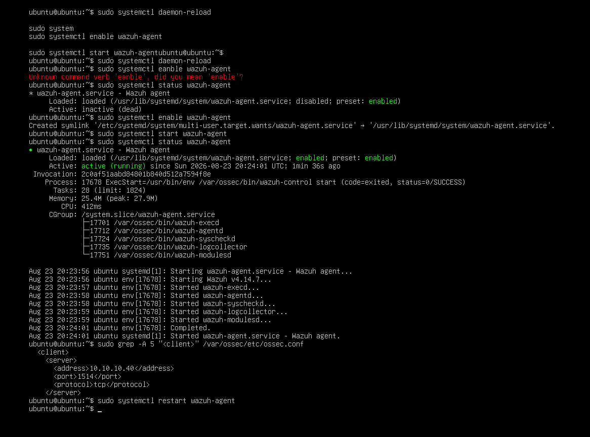
*Figure 21 – Verifying active `wazuh-agent` service status via `systemctl`.*

---

### Agent Configuration Troubleshooting:

#### Issue: Loopback / Self-Referential Manager IP
Initially, the agent configuration (`/var/ossec/etc/ossec.conf`) on the Ubuntu endpoint accidentally pointed to its own local IP (`10.10.10.40`) as the manager address.

#### Resolution:
The configuration was updated to direct telemetry to the actual Wazuh Manager (`10.10.10.10`):

```xml
<!-- File: /var/ossec/etc/ossec.conf -->
<client>
  <server>
    <address>10.10.10.10</address>
    <port>1514</port>
    <protocol>tcp</protocol>
  </server>
</client>
```

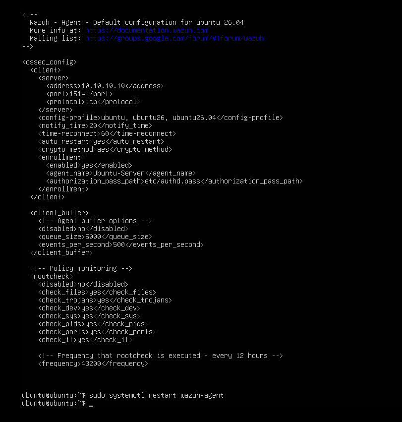
*Figure 22 – Correcting the manager `<address>` parameter to `10.10.10.10` in `/var/ossec/etc/ossec.conf`.*

#### Restart Service:
```bash
sudo systemctl restart wazuh-agent
```

---

### Final Multi-Endpoint Dashboard View:

Following configuration correction, both the Windows 10 host and the Ubuntu Server host appeared in the Wazuh SIEM agent management console:

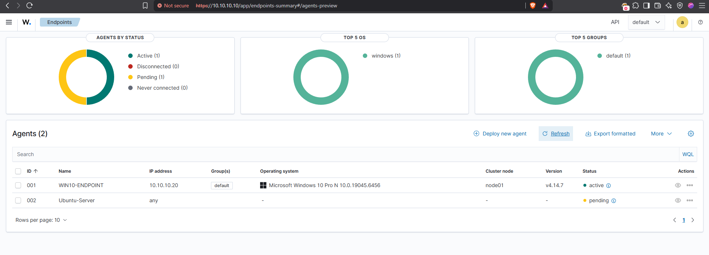
*Figure 23 – Central Wazuh Dashboard displaying multi-endpoint registration (`WIN10-ENDPOINT` Active and `Ubuntu-Server` Pending/Connecting).*

---

## 14. Implementation Status Matrix

| Subsystem | Status | Verification Criteria |
|---|:---:|---|
| **Ubuntu Server 26.04 (Manager)** | ✅ Completed | All-in-one installation complete; service active |
| **VMware NAT Network** | ✅ Completed | External Internet connectivity verified on all nodes |
| **VMnet1 Host-Only Network** | ✅ Completed | Static `10.10.10.0/24` subnet functional without IP drift |
| **Wazuh Dashboard UI** | ✅ Completed | Accessible via `https://10.10.10.10` |
| **Windows 10 Endpoint** | ✅ Completed | Static IP `10.10.10.20`; ping reachability confirmed |
| **Windows Wazuh Agent** | ✅ Active | Status `Active`; sending logs to manager |
| **Microsoft Sysmon** | ✅ Active | Operational logs generating Event ID 1 & 5 telemetry |
| **Kali Linux Tester** | ✅ Completed | Dual-homed IP `10.10.10.30`; connectivity verified |
| **Ubuntu Endpoint Agent** | ✅ Active | Registered to Manager (`10.10.10.10`); service online |
| **SIEM Log Ingestion** | ✅ Verified | Central alerts visible under Wazuh Dashboard Discover/Events |

---

## 15. Master Command Reference

### Ubuntu Server (Wazuh Manager):
```bash
# Check network interface IP allocation
ip a

# Verify Ubuntu version details
lsb_release -a

# Run Wazuh All-in-One installer
sudo bash wazuh-install.sh -a

# View Manager status
sudo wazuh-control status
```

### Windows 10 Endpoint (PowerShell / CMD):
```powershell
# Network configuration check
ipconfig /all

# Check ICMP ping reachability
ping 10.10.10.10

# Read last 30 lines of Wazuh agent log
Get-Content 'C:\Program Files (x86)\ossec-agent\ossec.log' -Tail 30

# Check Wazuh agent service state (Elevated)
Get-Service Wazuh

# Restart Wazuh agent service (Elevated)
Restart-Service Wazuh

# Install Microsoft Sysmon with config schema
Sysmon64.exe -i sysmonconfig.xml -accepteula
```

### Ubuntu Linux Endpoint:
```bash
# Install agent debian package
sudo dpkg -i wazuh-agent_4.14.7-1_amd64.deb

# Enable and start agent service
sudo systemctl enable wazuh-agent
sudo systemctl start wazuh-agent

# Monitor agent log output
sudo tail -f /var/ossec/logs/ossec.log
```

---

## 🎯 Next Steps & Future Enhancements

- 🧪 **MITRE ATT&CK Simulations:** Execute controlled adversary simulations using Atomic Red Team from Kali Linux.
- 📁 **File Integrity Monitoring (FIM):** Configure real-time file monitoring on critical system directories (`/etc`, `/bin`, `C:\Windows\System32`).
- 🚨 **Custom Rule Engineering:** Author custom Wazuh detection rules (`/var/ossec/etc/rules/local_rules.xml`) for high-severity threshold alerting.
- 🔄 **Active Response Automation:** Enable automated IP banning via Fail2Ban and Wazuh Active Response integrations.
